# Gamification System Relational Diagram

```mermaid
graph TB
    %% Data Sources
    JSON[assets/gamification.json] --> |"Loads config"| LocalSource[GamificationLocalSourceFetcher]
    LocalSource --> |"Fetches data"| GamificationEntity[GamificationEntity]
    
    %% Core Entities
    GamificationEntity --> |"Contains"| DifficultyCriteria[DifficultyCriteriaEntity]
    GamificationEntity --> |"Contains"| LevelEntity[LevelEntity]
    
    %% Difficulty Criteria Details
    DifficultyCriteria --> |"Easy: 90% acc, 50 WPM, 5m, 150 XP"| EasyCriteria[Easy Criteria]
    DifficultyCriteria --> |"Medium: 95% acc, 30 WPM, 4m, 250 XP"| MediumCriteria[Medium Criteria]
    DifficultyCriteria --> |"Hard: 98% acc, 40 WPM, 3m, 400 XP"| HardCriteria[Hard Criteria]
    
    %% Level System
    LevelEntity --> |"Level 1: 0 XP"| Level1[Level 1]
    LevelEntity --> |"Level 2: 1000 XP"| Level2[Level 2]
    LevelEntity --> |"Level 50: 800M XP"| Level50[Level 50]
    
    %% Repository Layer
    LocalSource --> |"Implements"| DataFetcher[GamificationDataFetcher]
    DataFetcher --> |"Used by"| GamificationRepo[GamificationRepoImpl]
    GamificationRepo --> |"Uses"| GamificationCache[GamificationCache]
    GamificationCache --> |"Stores in"| SharedPrefs[SharedPreferences]
    
    %% XP Calculation System
    TypingSession[Typing Session] --> |"Records"| SessionData[Session Data]
    SessionData --> |"Contains"| TypedChars[Typed Characters]
    SessionData --> |"Contains"| CorrectChars[Correct Characters]
    SessionData --> |"Contains"| Errors[Errors]
    SessionData --> |"Contains"| ElapsedTime[Elapsed Time]
    SessionData --> |"Contains"| Difficulty[Selected Difficulty]
    
    %% XP Calculation Flow
    SessionData --> |"Triggers"| XPCalculation[XP Calculation]
    XPCalculation --> |"Uses"| XPMultiplier[XpMultiplier Enum]
    XPMultiplier --> |"Easy: 150"| EasyXP[Easy XP Multiplier]
    XPMultiplier --> |"Medium: 250"| MediumXP[Medium XP Multiplier]
    XPMultiplier --> |"Hard: 400"| HardXP[Hard XP Multiplier]
    
    %% Difficulty Multiplier
    XPCalculation --> |"Uses"| DifficultyMultiplier[DifficultyMultiplier Enum]
    DifficultyMultiplier --> |"Easy: 1.0x"| EasyDiff[Easy Difficulty Multiplier]
    DifficultyMultiplier --> |"Medium: 1.2x"| MediumDiff[Medium Difficulty Multiplier]
    DifficultyMultiplier --> |"Hard: 1.5x"| HardDiff[Hard Difficulty Multiplier]
    
    %% Database Storage
    XPCalculation --> |"Saves to"| XPDatabase[(XP Entries Table)]
    XPDatabase --> |"Fields"| XPFields[ID, Timestamp, Mode, Amount, Synced, SessionID]
    
    %% Session Storage
    SessionData --> |"Saves to"| SessionDatabase[(Typing Sessions Table)]
    SessionDatabase --> |"Fields"| SessionFields[ID, Mode, Difficulty, StartedAt, EndedAt, Typed, Correct, Errors, ElapsedMs]
    
    %% UI Triggers
    PracticeComplete[Practice Complete] --> |"Triggers"| XPCalculation
    DifficultyChange[Difficulty Change] --> |"Updates"| XPCalculation
    RandomizeButton[Randomize Button] --> |"May trigger"| XPCalculation
    
    %% Level Progression
    XPCalculation --> |"Updates"| UserXP[User Total XP]
    UserXP --> |"Compared against"| LevelEntity
    LevelEntity --> |"Determines"| CurrentLevel[Current User Level]
    CurrentLevel --> |"Displays in"| LevelIndicator[Level XP Indicator Widget]
    
    %% UI Components
    LevelIndicator --> |"Shows"| LevelProgress[Level Progress]
    LevelProgress --> |"Based on"| UserXP
    LevelProgress --> |"Compared to"| LevelEntity
    
    %% Practice Configuration
    PracticeConfig[Practice Configuration] --> |"Contains"| Difficulty[Selected Difficulty]
    PracticeConfig --> |"Contains"| Mode[Practice Mode]
    PracticeConfig --> |"Contains"| Settings[Other Settings]
    
    %% Triggers for Gamification Updates
    TypingSession --> |"On Complete"| PracticeComplete
    PracticeComplete --> |"Calculates XP"| XPCalculation
    XPCalculation --> |"Updates Level"| CurrentLevel
    CurrentLevel --> |"Refreshes UI"| LevelIndicator
    
    %% Configuration Changes
    SettingsChange[Settings Change] --> |"May affect"| XPCalculation
    DifficultyChange --> |"Changes multipliers"| XPMultiplier
    DifficultyChange --> |"Changes multipliers"| DifficultyMultiplier
    
    %% Data Flow
    JSON --> |"App Startup"| LocalSource
    LocalSource --> |"Cached"| GamificationCache
    GamificationCache --> |"Available to"| GamificationRepo
    GamificationRepo --> |"Provides data to"| XPCalculation
    
    %% Styling
    classDef dataSource fill:#e1f5fe
    classDef entity fill:#f3e5f5
    classDef calculation fill:#fff3e0
    classDef storage fill:#e8f5e8
    classDef ui fill:#fce4ec
    classDef trigger fill:#fff8e1
    
    class JSON,LocalSource dataSource
    class GamificationEntity,DifficultyCriteria,LevelEntity entity
    class XPCalculation,XPMultiplier,DifficultyMultiplier calculation
    class XPDatabase,SessionDatabase,SharedPrefs storage
    class LevelIndicator,LevelProgress ui
    class PracticeComplete,DifficultyChange,RandomizeButton trigger
```



## Key Triggers for Gamification Updates:

### 1. **Practice Session Completion**
- **Trigger**: User completes a typing session
- **Action**: XP calculation based on performance
- **Formula**: `XP = (Correct Characters / 5) * XP Multiplier * Difficulty Multiplier`

### 2. **Difficulty Change**
- **Trigger**: User changes difficulty in settings
- **Action**: Updates XP multipliers for future sessions
- **Multipliers**:
  - Easy: 150 XP base, 1.0x difficulty
  - Medium: 250 XP base, 1.2x difficulty  
  - Hard: 400 XP base, 1.5x difficulty

### 3. **Level Progression**
- **Trigger**: User XP reaches next level threshold
- **Action**: Level up notification and UI update
- **Thresholds**: Defined in gamification.json (Level 1: 0 XP, Level 2: 1000 XP, etc.)

### 4. **Settings Changes**
- **Trigger**: User modifies practice settings
- **Action**: May affect XP calculation parameters
- **Impact**: Difficulty changes affect multipliers

### 5. **Randomize Button**
- **Trigger**: User clicks randomize to get new content
- **Action**: May trigger new session with current difficulty settings
- **Impact**: New session uses current XP multipliers

## XP Calculation Formula:
```
XP = (Correct Characters ÷ 5) × XP Multiplier × Difficulty Multiplier
```

## Level System:
- **59 Levels** defined in gamification.json
- **Progressive XP requirements** (Level 1: 0 XP → Level 59: 800M XP)
- **Real-time level calculation** based on total user XP
