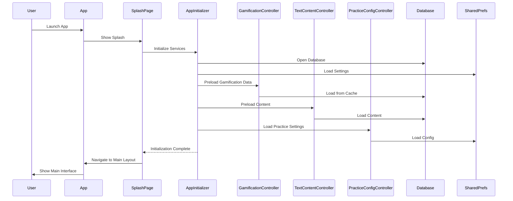
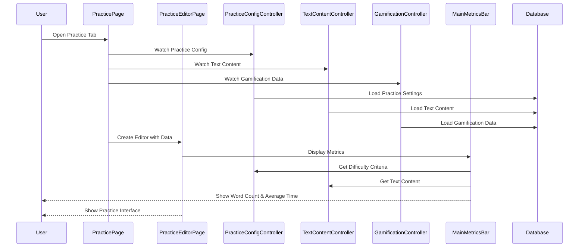
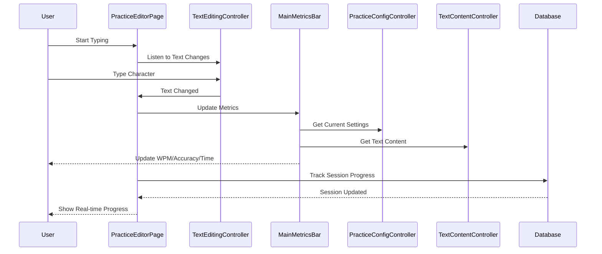
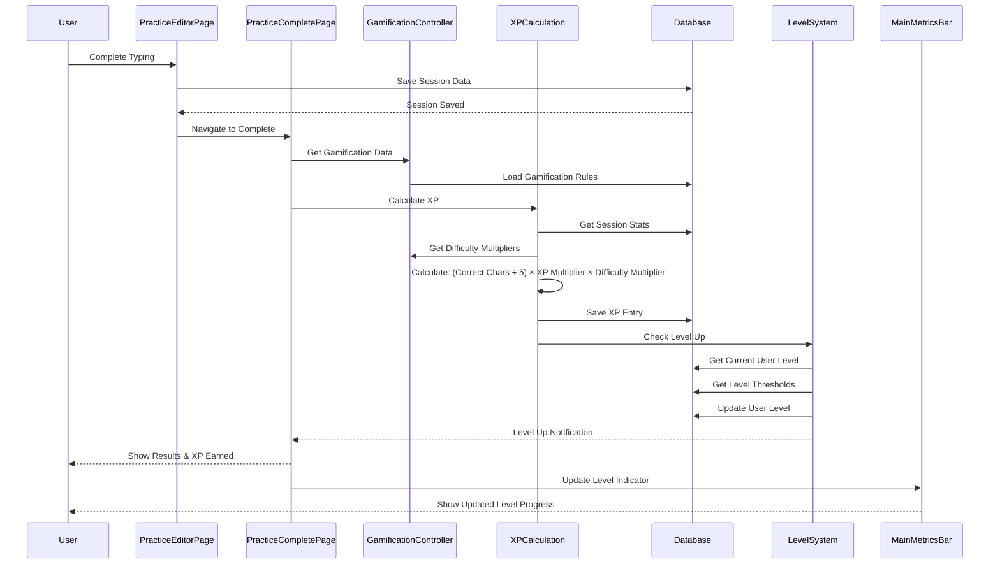
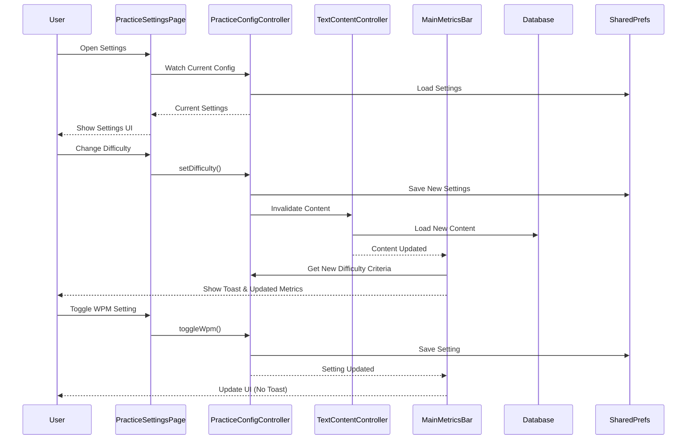
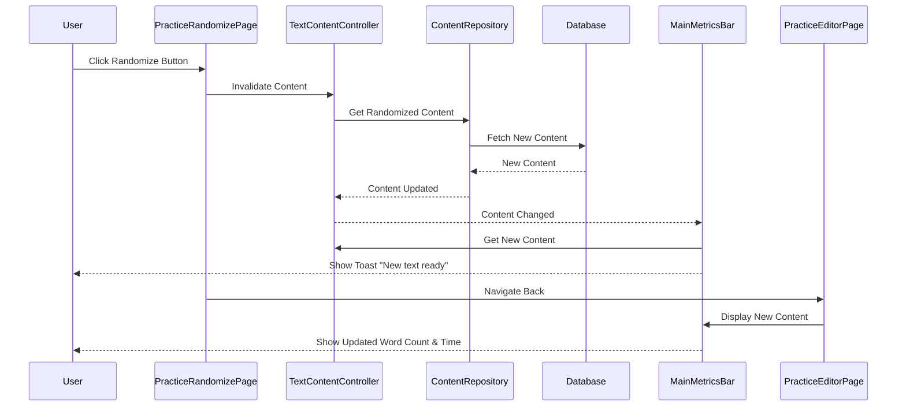
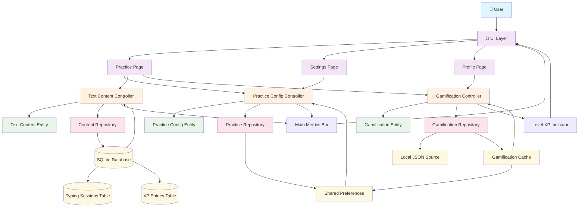

# Visai Typing App - Complete Relational & Sequence Diagrams

## 1. RELATIONAL DIAGRAM (Entity Relationship)

```mermaid
erDiagram
    %% Core Entities
    GamificationEntity {
        List<DifficultyCriteriaEntity> difficultyCriteria
        List<LevelEntity> levels
    }
    
    DifficultyCriteriaEntity {
        String type
        int accuracy
        int wpm
        String timelimit
        double xpMultiplier
        double difficultyMultiplier
    }
    
    LevelEntity {
        String level
        int totalXp
    }
    
    TextContentEntity {
        String id
        String content
        DifficultyEnum difficulty
        int wordCount
    }
    
    PracticeConfigEntity {
        ExpertiseModeEnum mode
        DifficultyEnum difficulty
        TextLengthEnum contentLength
        TextSizeEnum contentFontSize
        bool blindMode
        bool randomize
        bool wpmEnabled
        bool accuracyEnabled
        bool timerEnabled
        bool errorsEnabled
        bool allowPauses
        bool allowTakeBacks
        bool soundEnabled
        bool soundOnError
        bool hapticEnabled
        bool hapticOnError
        bool darkMode
    }
    
    TypingSessionEntity {
        String sessionId
        String paragraphId
        int cursor
        int typed
        int correct
        int errors
        Duration elapsed
        bool isRunning
    }
    
    XPEntryEntity {
        String id
        int timestamp
        String mode
        int amount
        bool synced
        String sessionId
    }
    
    UserProfileEntity {
        String userId
        String email
        int totalXP
        int currentLevel
        String displayName
        DateTime lastActive
    }
    
    %% Enums
    DifficultyEnum {
        easy
        medium
        hard
    }
    
    PracticeStatusEnum {
        start
        pause
        stop
        resume
        showStop
        showReset
        complete
    }
    
    XpMultiplier {
        easy: 150
        medium: 250
        hard: 400
    }
    
    DifficultyMultiplier {
        easy: 1.0
        medium: 1.2
        hard: 1.5
    }
    
    %% Relationships
    GamificationEntity ||--o{ DifficultyCriteriaEntity : contains
    GamificationEntity ||--o{ LevelEntity : contains
    DifficultyCriteriaEntity ||--|| DifficultyEnum : maps_to
    PracticeConfigEntity ||--|| DifficultyEnum : uses
    PracticeConfigEntity ||--|| XpMultiplier : uses
    PracticeConfigEntity ||--|| DifficultyMultiplier : uses
    TypingSessionEntity ||--|| TextContentEntity : references
    TypingSessionEntity ||--|| PracticeConfigEntity : uses
    TypingSessionEntity ||--o{ XPEntryEntity : generates
    UserProfileEntity ||--o{ TypingSessionEntity : has
    UserProfileEntity ||--|| LevelEntity : current_level
    XPEntryEntity ||--|| DifficultyEnum : based_on
```

## 2. CLASS RELATIONSHIP DIAGRAM

```mermaid
classDiagram
    %% Presentation Layer
    class PracticePage {
        +TextEditingController controller
        +FocusNode focusNode
        +GamificationEntity gamificationData
        +build() Widget
    }
    
    class PracticeEditorPage {
        +TextEditingController controller
        +FocusNode focusNode
        +GamificationEntity gamificationData
        +build() Widget
    }
    
    class MainMetricsBar {
        +String paragraph
        +DifficultyCriteriaEntity difficulty
        +build() Widget
    }
    
    class BottomNavigationBarWidget {
        +build() Widget
    }
    
    %% Controllers/Providers
    class PracticeConfigController {
        +PracticeConfig state
        +setDifficulty(DifficultyEnum)
        +toggleWpm()
        +toggleAccuracy()
        +toggleTimer()
    }
    
    class TextContentController {
        +TextContent? state
        +build() TextContent?
    }
    
    class GamificationController {
        +GamificationEntity? state
        +build() GamificationEntity?
    }
    
    class SelectNavNotifier {
        +int state
        +set(int index)
        +routeFor(int index) String
    }
    
    %% Domain Entities
    class GamificationEntity {
        +List~DifficultyCriteriaEntity~ difficultyCriteria
        +List~LevelEntity~ levels
        +fromJson(Map) GamificationEntity
        +toJson() Map
    }
    
    class DifficultyCriteriaEntity {
        +String type
        +int accuracy
        +int wpm
        +String timelimit
        +double xpMultiplier
        +double difficultyMultiplier
    }
    
    class TextContentEntity {
        +String id
        +String content
        +DifficultyEnum difficulty
        +int wordCount
    }
    
    class PracticeConfigEntity {
        +ExpertiseModeEnum mode
        +DifficultyEnum difficulty
        +bool wpmEnabled
        +bool accuracyEnabled
        +bool timerEnabled
        +copyWith() PracticeConfigEntity
    }
    
    %% Data Sources
    class GamificationLocalSourceFetcher {
        +fetch() Future~GamificationEntity?~
    }
    
    class GamificationRepoImpl {
        +GamificationDataFetcher fetcher
        +GamificationCache cache
        +getGamificationData() Future~GamificationEntity?~
        +preloadGamificationData() Future~void~
    }
    
    class GamificationCache {
        +SharedPrefsService prefs
        +write(GamificationEntity) Future~void~
        +read() Future~GamificationEntity?~
    }
    
    class AppDatabase {
        +open() Future~Database~
        +typing_sessions table
        +xp_entries table
    }
    
    %% Services
    class AuthService {
        +FirebaseAuth auth
        +FirebaseFirestore db
        +signIn(String email, String password)
        +signUp(String email, String password)
    }
    
    class SharedPrefsService {
        +setString(String key, String value)
        +getString(String key) String?
        +remove(String key)
    }
    
    %% Relationships
    PracticePage --> PracticeEditorPage : contains
    PracticePage --> MainMetricsBar : uses
    PracticePage --> BottomNavigationBarWidget : uses
    PracticeEditorPage --> MainMetricsBar : uses
    
    PracticePage --> PracticeConfigController : watches
    PracticePage --> TextContentController : watches
    PracticePage --> GamificationController : watches
    
    PracticeConfigController --> PracticeConfigEntity : manages
    TextContentController --> TextContentEntity : manages
    GamificationController --> GamificationEntity : manages
    
    GamificationEntity --> DifficultyCriteriaEntity : contains
    GamificationEntity --> LevelEntity : contains
    
    GamificationRepoImpl --> GamificationLocalSourceFetcher : uses
    GamificationRepoImpl --> GamificationCache : uses
    GamificationCache --> SharedPrefsService : uses
    
    AppDatabase --> TypingSessionEntity : stores
    AppDatabase --> XPEntryEntity : stores
```



## 3. SEQUENCE DIAGRAMS

### 3.1 App Initialization Sequence



### 3.2 Practice Session Start Sequence



### 3.3 Typing Session Progress Sequence



### 3.4 Practice Session Complete Sequence



### 3.5 Settings Change Sequence



### 3.6 Randomize Content Sequence



## 4. DATA FLOW DIAGRAM



## 5. COMPONENT INTERACTION DIAGRAM

```mermaid
graph TB
    %% Main App Components
    subgraph "App Layer"
        App[App]
        SplashPage[Splash Page]
        MainLayout[Main Layout]
    end
    
    subgraph "Feature Modules"
        subgraph "Practice Feature"
            PracticePage[Practice Page]
            PracticeEditor[Practice Editor]
            PracticeSettings[Practice Settings]
            PracticeComplete[Practice Complete]
            PracticeRandomize[Practice Randomize]
        end
        
        subgraph "Authentication Feature"
            LoginPage[Login Page]
            SignupPage[Signup Page]
            AuthService[Auth Service]
        end
        
        subgraph "Profile Feature"
            ProfilePage[Profile Page]
            UserStats[User Statistics]
        end
    end
    
    subgraph "State Management"
        subgraph "Riverpod Providers"
            PracticeConfigProvider[Practice Config Provider]
            TextContentProvider[Text Content Provider]
            GamificationProvider[Gamification Provider]
            NavigationProvider[Navigation Provider]
            ThemeProvider[Theme Provider]
        end
    end
    
    subgraph "Domain Layer"
        subgraph "Entities"
            PracticeConfig[Practice Config]
            TextContent[Text Content]
            Gamification[Gamification]
            DifficultyCriteria[Difficulty Criteria]
            Level[Level Entity]
        end
        
        subgraph "Enums"
            DifficultyEnum[Difficulty Enum]
            PracticeStatus[Practice Status]
            XpMultiplier[XP Multiplier]
        end
    end
    
    subgraph "Data Layer"
        subgraph "Repositories"
            PracticeRepo[Practice Repository]
            ContentRepo[Content Repository]
            GamificationRepo[Gamification Repository]
        end
        
        subgraph "Data Sources"
            Database[(SQLite Database)]
            SharedPrefs[Shared Preferences]
            LocalJSON[Local JSON Assets]
        end
    end
    
    %% Connections
    App --> SplashPage
    SplashPage --> MainLayout
    MainLayout --> PracticePage
    MainLayout --> ProfilePage
    
    PracticePage --> PracticeEditor
    PracticePage --> PracticeSettings
    PracticePage --> PracticeComplete
    PracticePage --> PracticeRandomize
    
    PracticePage --> PracticeConfigProvider
    PracticePage --> TextContentProvider
    PracticePage --> GamificationProvider
    
    PracticeConfigProvider --> PracticeConfig
    TextContentProvider --> TextContent
    GamificationProvider --> Gamification
    
    PracticeConfig --> DifficultyEnum
    Gamification --> DifficultyCriteria
    Gamification --> Level
    
    PracticeConfigProvider --> PracticeRepo
    TextContentProvider --> ContentRepo
    GamificationProvider --> GamificationRepo
    
    PracticeRepo --> SharedPrefs
    ContentRepo --> Database
    GamificationRepo --> LocalJSON
    GamificationRepo --> SharedPrefs
    
    %% Styling
    classDef appClass fill:#e3f2fd
    classDef featureClass fill:#f1f8e9
    classDef stateClass fill:#fff3e0
    classDef domainClass fill:#fce4ec
    classDef dataClass fill:#f3e5f5
    
    class App,SplashPage,MainLayout appClass
    class PracticePage,PracticeEditor,PracticeSettings,PracticeComplete,PracticeRandomize,LoginPage,SignupPage,AuthService,ProfilePage,UserStats featureClass
    class PracticeConfigProvider,TextContentProvider,GamificationProvider,NavigationProvider,ThemeProvider stateClass
    class PracticeConfig,TextContent,Gamification,DifficultyCriteria,Level,DifficultyEnum,PracticeStatus,XpMultiplier domainClass
    class PracticeRepo,ContentRepo,GamificationRepo,Database,SharedPrefs,LocalJSON dataClass
```



## 6. KEY RELATIONSHIPS SUMMARY

### **Core Relationships:**
1. **PracticePage** → **PracticeEditorPage** → **MainMetricsBar**
2. **PracticeConfigController** → **PracticeConfigEntity** → **SharedPreferences**
3. **TextContentController** → **TextContentEntity** → **Database**
4. **GamificationController** → **GamificationEntity** → **Local JSON + Cache**
5. **XP Calculation** → **Session Data** → **Level System** → **UI Update**

### **Data Flow Patterns:**
1. **User Action** → **Controller** → **Repository** → **Data Source** → **Entity** → **UI Update**
2. **Settings Change** → **Provider Update** → **Cache Save** → **UI Refresh**
3. **Session Complete** → **XP Calculation** → **Level Check** → **Database Save** → **UI Notification**

### **Dependency Hierarchy:**
1. **UI Layer** depends on **State Management**
2. **State Management** depends on **Domain Layer**
3. **Domain Layer** depends on **Data Layer**
4. **Data Layer** depends on **External Services**

This comprehensive diagram set provides a complete view of your Visai Typing App's architecture, relationships, and interaction flows.
